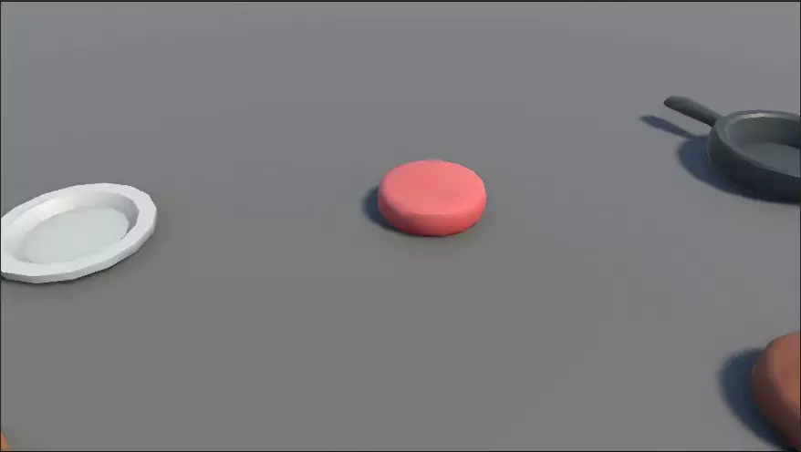

# Culinary Master

## Takım İsmi

U40 Unity Takımı

## Takım Üyeleri

* ***Alihan Esen*** - Product Owner

* ***Fatmanur Sudenaz Helvacı*** - Scrum Master

* ***Rüştü Eren Çaya*** - Developer

* ***Süeda Nur Sarıcan*** - Developer

* ***Ferhat Pamuk*** - Developer

## Oyun İsmi

Culinary Master

## Product Backlog URL
- [Miro Backlog](https://miro.com/welcomeonboard/WFJIbk96L3c4OGRuWmp1QXdmeWl6dTlleXNOUENBWjY2YzU5amszaUVMREZtYzlwbHFDQ1NPZ1ljanFncmRzSXBNMzU5a24zclYweVdYdDJTTWU5eVRNUUZIK3NMT2g1MTNmQWJLSjFzVEpmNWp0dTI3dXBwYlNvVjJ5WjJTY0FQdGo1ZEV3bUdPQWRZUHQzSGl6V2NBPT0hdjE=?share_link_id=270457716585)

## Oyun Açıklaması

Culinary Master, oyuncuların kendi restoranlarını işlettikleri, çeşitli yemekler hazırlayıp müşterilere servis ederek restoranlarını büyüttükleri ve bu süreçte eğlenceli anlar yaşadıkları keyifli bir simülasyon ve yönetim oyunudur. Oyuncular, mutfak becerilerini geliştirirken, yeni tarifler öğrenirken ve restoranlarını dekore ederken kendilerini ev sıcaklığında bir mutfak macerasının içinde bulacaklar.

## Oyun Özellikleri

* Restoran Yönetimi ve Geliştirme

* Çeşitli Yemek Tarifleri ve Pişirme Mekanikleri

* Müşteri İlişkileri ve Memnuniyeti

* Restoran Dekorasyonu ve Kişiselleştirme

* Eğlenceli ve Sürükleyici Oynanış

## Hedef Kitle

* Simülasyon ve yönetim oyunları sevenler

* Yemek yapma ve mutfak temalı oyunlara ilgi duyanlar

* Her yaştan (3+) oyuncular

* Rahatlatıcı ve eğlenceli bir deneyim arayanlar

* Mobil ve PC oyuncuları

---

# Sprint 1

- **Sprint içinde tamamlanması tahmin edilen puan**: 100 Puan

- **Puan tamamlama mantığı**: Bu sprintteki yoğunluğumuz ve herkesin katılım durumları değerlendirilerek llk sprinte 100 puan ile başlamamız gerektiğine karar verdik.

- **Daily Scrum**: Günlük Scrum toplantılarımızı Discord üzerinden yapmaya karar verdik. Günlük Scrum toplantılarımızın özetini Docs linkinde bulabilirsiniz: [Sprint 1 - Daily Scrums](https://docs.google.com/document/d/1dmeMon_664vLSAqMdl2b3_5ERpEGoeURvYLJVHWIcCg/edit?usp=sharing)

- **Sprint board update**: Sprint board screenshot: 
 

 
<h3>Ekran Görüntüleri</h3>

  
  
   
  
  

  

- **Sprint Review**: 
  - Bütün ekip projede kendisine düşen sorumlukluklardan memnuniyetini belirtti ve proje hakkında hevesini belirtti. Oyunun ilerleyişi ve vizyonu ekip arkadaşları tarafından beğenildi, herhangi bir sorun ile karşılaşılmadı.
  - Sprint Review katılımcıları: Alihan Esen, Fatmanur Sudenaz Helvacı, Rüştü Eren Çaya 

- **Sprint Retrospective:** 
  - Ekip uzmanlıklara göre ikiye bölündü, bir grup oyunun genel tasarımı üzerine; diğer ekip ise oyunun programlama kısımlarına yoğunlaşacaktı.
    - Grup 1 (Tasarım): Eren, Sudenaz
    - Grup 2 (Programlama): Alihan, Süeda

# Sprint 2

- **Sprint içinde tamamlanması tahmin edilen puan**: 80 Puan

- **Puan tamamlama mantığı**: Bu sprintte bazılarımıazın stajının başlaması ve kişisel durumlar değerlendirilerek 80 puan tamamlamamız gerektiğine karar verdik.

- **Daily Scrum**: Günlük Scrum toplantılarımızı Discord üzerinden yapmaya karar verdik. Günlük Scrum toplantılarımızın ekran görüntülerini burada bulabilirsiniz: [Sprint 2 - Daily Scrums](RepoFiles/images/Sprint2/DailyScrums)

- **Sprint board update**: Sprint board screenshot: 
 

 
<h3>Ekran Görüntüleri</h3>

  
  
   
  
  
  
  
  

  

- **Sprint Review**: 
  - Ekip olarak çalıştıkça proje üzerinde çalışmanın daha eğelenceli hale geldiğini ve artık oyundan katı sonuçlar görebildiğimiz evreye vardığımızı farkettik. Bu da bizi proje için daha motive hale getirdi.
  - Sprint Review katılımcıları: Alihan Esen, Fatmanur Sudenaz Helvacı, Rüştü Eren Çaya 

- **Sprint Retrospective:** 
  - Ekiptekiler önceki sprintte kendilerine verilen görevlerden memnun olduğunu ve oldukları departmanda çalışmaya devam etmek istediklerini belirtti
    - Grup 1 (Tasarım): Eren, Sudenaz
    - Grup 2 (Programlama): Alihan, Süeda
